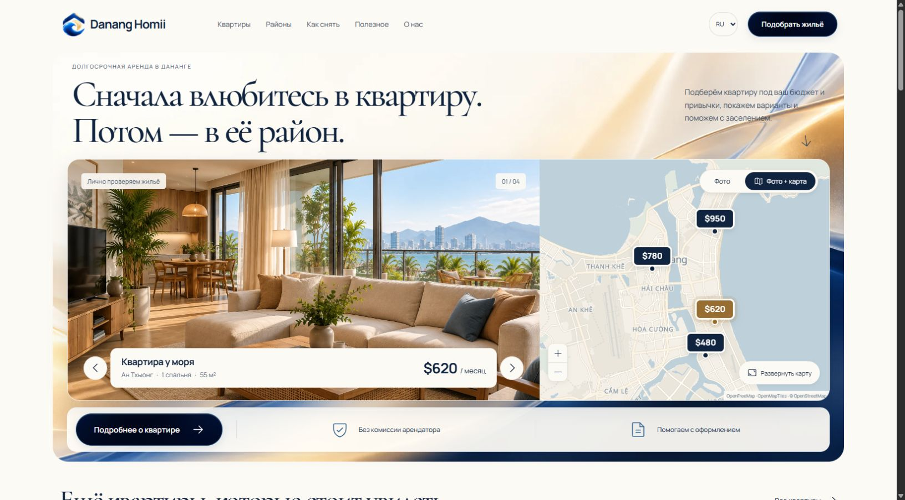

# Danang Homii

Сайт подбора квартир для долгосрочной аренды в Дананге. React + Vite, русский / English / Tiếng Việt, интерактивная карта и сине-золотой визуальный стиль.

**[Открыть сайт](https://romans7997.github.io/danang-homii/)** · [English](https://romans7997.github.io/danang-homii/en/) · [Tiếng Việt](https://romans7997.github.io/danang-homii/vi/)

[Режим сравнения дизайна и повтор анимации](https://romans7997.github.io/danang-homii/ru/?variant=2&style=gradient&preview=1)



## Возможности

- 14 страниц на каждом языке: главная, каталог, 4 квартиры, районы, как снять, полезные материалы, 3 статьи, о нас и собственникам.
- Hero с фотографией и раскрывающейся картой; кликабельные цены появляются последовательно и переключают квартиру.
- Каталог с фильтрами, поиском на трёх языках, сортировкой, избранным и сохранением фильтров в URL.
- Переключение языка с сохранением маршрута и состояния; язык и избранное сохраняются локально.
- Полная карта, FAQ, формы подбора, просмотра и собственника с локальной валидацией.
- Адаптивная компоновка, клавиатурное управление и reduced-motion.
- Автоматические проверки, сборка и публикация через GitHub Actions.

**Это демонстрационная версия.** Четыре квартиры, цены и координаты приведены для примера. Интерьеры и иллюстрации сгенерированы, формы не отправляют заявки. Реальный каталог, условия объектов и backend ещё предстоит подключить. GitHub Pages размещает frontend.

## Запуск

Нужны Node.js 24 и npm.

```powershell
npm ci
npm run dev -- --host 127.0.0.1 --port 4173
```

Локальный адрес: `http://127.0.0.1:4173/`. Панель сравнения: `?variant=2&style=gradient&preview=1`. Основной вариант — 2; вариант 3 и тема `style=calm` сохранены для сравнения.

## Команды

| Команда | Назначение |
| --- | --- |
| `npm run dev` | Локальная разработка |
| `npm run build` | Сборка для корня сайта и исходного Sites worker |
| `npm run build:pages` | Сборка под `/danang-homii/` с прямыми адресами страниц |
| `npm run preview` | Просмотр готовой сборки |
| `npm run test:i18n` | Переводы, подстановки и дубликаты |
| `npm run test:sites` | Проверка worker после обычной сборки |
| `npm run test:pages` | Пути, прямые страницы и ассеты после сборки Pages |

Каждый push в `main` запускает публикацию. Статус: [Actions](https://github.com/RomanS7997/danang-homii/actions).

## Документация и код

- [Архитектура, карта файлов, добавление квартир и backend](docs/architecture.md)
- [Публикация, обновление и возврат к прошлой версии](docs/deployment.md)
- [Карта страниц](site-map.md)
- [Принципы проекта](AGENTS.md)
- [Визуальная и функциональная проверка](design-qa.md)
- [Изображения и брифы генерации](gradient-assets.md)
- [Логотип «дом и волна»](brand-logo.md)

В `src/` находится весь frontend; в `public/assets/` — WebP и PNG-оригиналы. Настройка CI — `.github/workflows/pages.yml`. Комментарии объясняют ключевые части маршрутизации, карты, анимации и сборки. `node_modules`, `.env`, готовый `dist` и служебные снимки проверки не включаются в Git: сборка воспроизводится из `package-lock.json`.

## Ассеты и источники

Визуальный стиль: ivory/navy, синие и шампань-градиенты, стеклянные иллюстрации, знак «дом и волна». Сгенерированные изображения не удостоверяют существование предложений аренды.

Часть текстов адаптирована по [старому сайту](https://www.dananghomesliving.com/en). Непроверенные телефоны, адреса и условия реальных объектов не переносились.

Карта: [Leaflet](https://leafletjs.com/), [MapLibre](https://maplibre.org/), [OpenFreeMap](https://openfreemap.org/), [OpenMapTiles](https://openmaptiles.org/), [OpenStreetMap](https://www.openstreetmap.org/copyright). Стиль адаптирован из Liberty, атрибуция сохранена. Иконки — [Phosphor](https://phosphoricons.com/).

Шрифт: системный San Francisco на Apple через `-apple-system`, локальный Inter Variable через Fontsource на Windows/Android. `SF Pro Display` указан первым для устройств, где он доступен. Файлы Apple не включены в проект: [условия Apple](https://developer.apple.com/fonts/). Кириллица, латиница и вьетнамские знаки поддерживаются. Размеры и адаптивные отступы заданы в `src/typography.css`: основной текст 16–17 px, кнопки 14–16 px, поля 16 px, второстепенные подписи 14–15 px. Заголовки разделов — 28–42 px, карточек — 18 px.
